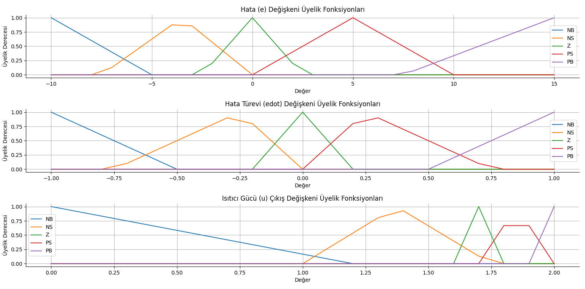
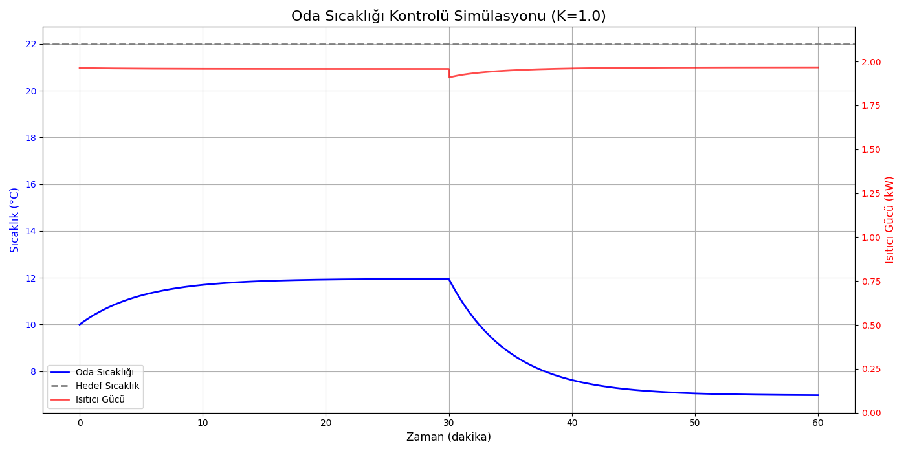
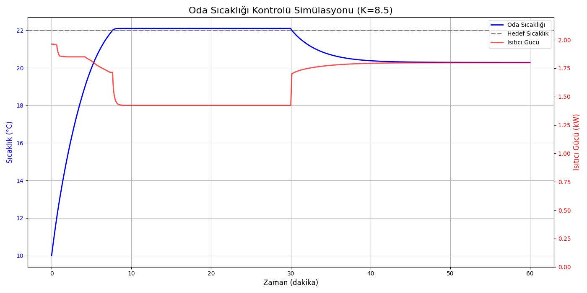
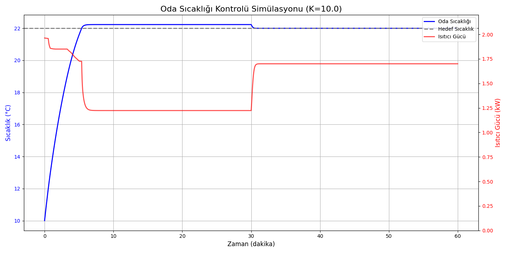

# Bulanık Mantık ile Oda Sıcaklığı Denetleyici Tasarımı

Bu proje, **Soru 1 - Mamdani Tipi Oda Sıcaklığı Denetleyicisi** ödevi kapsamında geliştirilmiştir. Proje, sadece bir bulanık mantık denetleyicisi implementasyonundan ibaret olmayıp, bir kontrol sisteminin tasarım sürecindeki **analitik modelleme, iteratif iyileştirme, fiziksel sınırlılıkların tespiti ve parametre optimizasyonu** gibi temel mühendislik adımlarını içeren bir vaka çalışması niteliğindedir.

## Projenin Amacı

25 m²'lik bir odanın sıcaklığını, 2 kW'lık bir elektrikli ısıtıcı kullanarak, değişken dış ortam koşulları altında 22°C'de sabit tutan sağlam (robust) bir bulanık mantık denetleyicisi tasarlamaktır. Başarı kriterleri; düşük aşım (overshoot), hızlı yerleşme süresi (settling time) ve bozucu etkilere karşı kararlılıktır.

## Metodoloji ve Sistem Tasarımı

Proje, aşağıda detaylandırılan adımları izleyerek geliştirilmiştir.

### 1. Sistem Modelleme ve Analizi

Odanın basitleştirilmiş termal davranışı, Newton'un Soğuma Yasası'nı temel alan aşağıdaki birinci dereceden diferansiyel denklem ile modellenmiştir:

$$
\frac{dT_{oda}}{dt} = -\frac{1}{\tau} \cdot [T_{oda}(t) - T_{dış}(t)] + \frac{K}{\tau} \cdot u(t)
$$

Burada;
- $T_{oda}(t)$: Odanın anlık sıcaklığı (°C)
- $T_{dış}(t)$: Dış ortamın anlık sıcaklığı (°C)
- $u(t)$: Isıtıcının kontrol gücü (kW)
- $\tau$: Sistemin zaman sabiti (300 s)
- $K$: Sistemin kazancı (°C/kW)

### 2. Fiziksel Sınırlılıkların Tespiti ve Parametre Seçimi

Bir kontrol sisteminin başarısı, kontrol edilecek sistemin (plant) fiziksel limitlerine bağlıdır. Bu nedenle, sistemin denge durumu analiz edilmiştir. Denge durumunda ($\frac{dT_{oda}}{dt} = 0$), belirli bir sıcaklığı korumak için gereken güç ($u_{denge}$) şu denklemle ifade edilir:

$$
u_{denge} = \frac{T_{denge} - T_{dış}}{K}
$$

Bu denklem kullanılarak, sistemin 22°C hedefine ulaşabilmesi için gereken minimum sistem kazancı ($K_{min}$) hesaplanmıştır. En zorlu koşul ($T_{dış}=5°C$) ve maksimum ısıtıcı gücü ($u_{max}=2.0kW$) altında:

$$
K_{min} = \frac{T_{hedef} - T_{dış,min}}{u_{max}} = \frac{22 - 5}{2.0} = 8.50
$$

Bu analiz, ödevde verilen `K = 1` değeriyle hedefe ulaşmanın **fiziksel olarak imkansız** olduğunu kanıtlamıştır. Ayrıca `K = 8.50` ile yapılan testler, sistemin bozucu etki altında kararsız kaldığını göstermiştir. Bu nedenle, bir **güvenlik payı (safety margin)** bırakılarak nihai tasarımda optimum performans için **`K = 10.0`** değeri seçilmiştir.

### 3. Bulanık Mantık Denetleyici Tasarımı

Denetleyici, Mamdani tipi bir bulanık çıkarım sistemi olarak tasarlanmıştır.

#### 3.1. Linguistik Değişkenler ve Üyelik Fonksiyonları
- **Girişler:** Hata (`e`) ve Hata Türevi (`ė`).
- **Çıkış:** Isıtıcı Gücü (`u`).
- **Terimler:** Tüm değişkenler için `NB, NS, Z, PS, PB` dilsel terimleri ve üçgensel üyelik fonksiyonları kullanılmıştır. Özellikle çıkış değişkeninin `Z` (Orta) üyelik fonksiyonu, en zorlu koşuldaki teorik denge gücü olan **1.7 kW**'ı merkez alacak şekilde tasarlanmıştır. Bu, denetleyicinin kalıcı durum hatasına düşmesini önleyen kritik bir adımdır.

#### 3.2. Kural Tabanı

Bu çalışmada kullanılan 5×5 boyutundaki Mamdani tipi bulanık kural tabanı, hata (`e`) ve hata türevi (`ė`) giriş değişkenlerine dayalı olarak ısıtıcı gücünü (`u`) belirlemek üzere tasarlanmıştır. Tablo, beşer adet dilsel terim içeren üç değişkenin (giriş1, giriş2, çıkış) üçgensel üyelik fonksiyonları üzerine inşa edilmiştir. Aşağıda, söz konusu kural yapısı hem kontrol stratejisi hem de sistem dinamiklerine uygunluğu açısından değerlendirilmiştir.

##### 3.2.1. Yapısal ve Kavramsal İnceleme

Kural tabanı, klasik bulanık kontrol ilkeleri çerçevesinde tasarlanmış olup hata (`e`) büyüklüğü ve yönüne göre sistemin ısıtıcı gücünü artırma veya azaltma eğiliminde olacak şekilde modellenmiştir. Hata türevi (`ė`) ise sistemin gelecekteki eğilimini (artan/azalan sıcaklık) dikkate alarak çıkışın proaktif olarak modifiye edilmesini sağlamaktadır.

| `e` \ `ė` |  NB |  NS |  Z  |  PS |  PB |
|:--------: | :-: | :-: | :-: | :-: | :-: |
|**PB**     |  PB |  PB |  PB |  PS |  Z  |
|**PS**     |  PB |  PS |  PS |  Z  |  NS |
|**Z**      |  PS |  PS |  Z  |  Z  |  NS |
|**NS**     |  NS |  NS |  NB |  NB |  NB |
|**NB**     |  NS |  NB |  NB |  NB |  NB |

Bu yapı, sistemin soğuk bölgede yüksek güçle ısınmaya çalışmasını, sıcak bölgede ise ısıtmayı kademeli olarak azaltmasını sağlamaktadır.

##### 3.2.2. Kontrol Stratejisi Açısından Değerlendirme

* **Pozitif hata (`e > 0`)**: Oda sıcaklığı hedefin altındadır. `PB` ve `PS` satırlarında yüksek çıkış gücü (`PB`, `PS`) kullanılması, hızlı ısıtma amacıyla uygundur. Ancak `ė > 0` durumunda sistemin zaten ısınmakta olduğu anlaşılır ve bu durumda daha düşük çıkış seviyeleri (`Z`, `NS`) tercih edilerek aşım (overshoot) önlenir.

* **Sıfır hata (`e ≈ 0`)**: Hedef sıcaklık civarında denge korunmaya çalışılır. `ė < 0` durumunda ısı kaybı öngörülerek çıkış (`PS`) arttırılmakta, `ė > 0` için ise çıkış azaltılmaktadır (`NS`).

* **Negatif hata (`e < 0`)**: Oda sıcaklığı hedefin üzerindedir. `NS` ve `NB` satırlarında yer alan çıkışlar (çoğunlukla `NB` veya `NS`) ile ısıtıcı gücü azaltılarak sistemin sıcaklığı düşürülmeye çalışılır.

##### 3.2.3. Simetri ve İstikrar

Kural tabanı dikkatle dengelenmiş simetrik bir yapıya sahiptir. Bu simetri, sistemin pozitif ve negatif hatalara benzer şekilde ancak yönsel olarak zıt tepkiler vermesini sağlar. Böylece hem ısınma hem soğuma süreçlerinde benzer kararlılık ve performans elde edilir.

##### 3.2.4. Tasarım Rasyoneli ve Pratik Uygunluk

Kural tabanı, aşağıdaki tasarım prensiplerini gözeterek oluşturulmuştur:

* **Güvenli frenleme:** Hedefe yaklaşırken çıkış değeri azaltılarak aşım riski düşürülmüştür.
* **Proaktif tepki:** `ė` girişinin kullanılması, sistemin eğilimini öngörerek çıkışın zamanında ayarlanmasını sağlar.
* **Fiziksel sınırlara uygunluk:** Maksimum ısıtıcı gücünün 2.0 kW ile sınırlı olduğu göz önünde bulundurulmuştur. `PB` çıkışı yalnızca yüksek pozitif hatalarda kullanılmıştır.

### 4. Simülasyon ve Analiz
Denetleyici, 60 dakikalık bir simülasyon ile test edilmiştir. Simülasyonun 30. dakikasında dış sıcaklık 10°C'den 5°C'ye düşürülerek sisteme bir bozucu etki uygulanmıştır.

## Sonuçlar ve Tartışma
### Tasarlanan Üyelik Fonksiyonları
```python output
--- Tasarlanan Üyelik Fonksiyonları Gösteriliyor ---
```


### K = 1.0 İçin Çıktılar
```python output
--- Simülasyon Başlatılıyor (K=1.0) ---
Zaman:  0 dk | T_oda: 10.00°C | Hata: 12.00 | Güç: 1.96 kW
Zaman:  5 dk | T_oda: 11.24°C | Hata: 10.76 | Güç: 1.96 kW
Zaman: 10 dk | T_oda: 11.70°C | Hata: 10.30 | Güç: 1.96 kW
Zaman: 15 dk | T_oda: 11.86°C | Hata: 10.14 | Güç: 1.96 kW
Zaman: 20 dk | T_oda: 11.92°C | Hata: 10.08 | Güç: 1.96 kW
Zaman: 25 dk | T_oda: 11.94°C | Hata: 10.06 | Güç: 1.96 kW
Zaman: 30 dk | T_oda: 11.95°C | Hata: 10.05 | Güç: 1.96 kW
Zaman: 35 dk | T_oda:  8.78°C | Hata: 13.22 | Güç: 1.95 kW
Zaman: 40 dk | T_oda:  7.63°C | Hata: 14.37 | Güç: 1.96 kW
Zaman: 45 dk | T_oda:  7.21°C | Hata: 14.79 | Güç: 1.96 kW
Zaman: 50 dk | T_oda:  7.05°C | Hata: 14.95 | Güç: 1.97 kW
Zaman: 55 dk | T_oda:  7.00°C | Hata: 15.00 | Güç: 1.97 kW
Zaman: 60 dk | T_oda:  6.98°C | Hata: 15.02 | Güç: 1.97 kW
--- Simülasyon Tamamlandı ---

--- Performans Metrikleri Analizi ---
Sistemde aşım gözlemlenmedi.
Sistem simülasyon süresi boyunca hedefe yerleşemedi.
IAE (Integral of Absolute Error): 44257.41 °C·s
RMSE (Root Mean Square Error): 12.47 °C
```

### K = 8.5 İçin Çıktılar
```python output
--- Simülasyon Başlatılıyor (K=8.5) ---
Zaman:  0 dk | T_oda: 10.00°C | Hata: 12.00 | Güç: 1.96 kW
Zaman:  5 dk | T_oda: 19.99°C | Hata:  2.01 | Güç: 1.81 kW
Zaman: 10 dk | T_oda: 22.10°C | Hata: -0.10 | Güç: 1.42 kW
Zaman: 15 dk | T_oda: 22.10°C | Hata: -0.10 | Güç: 1.42 kW
Zaman: 20 dk | T_oda: 22.10°C | Hata: -0.10 | Güç: 1.42 kW
Zaman: 25 dk | T_oda: 22.10°C | Hata: -0.10 | Güç: 1.42 kW
Zaman: 30 dk | T_oda: 22.10°C | Hata: -0.10 | Güç: 1.42 kW
Zaman: 35 dk | T_oda: 20.70°C | Hata:  1.30 | Güç: 1.78 kW
Zaman: 40 dk | T_oda: 20.38°C | Hata:  1.62 | Güç: 1.79 kW
Zaman: 45 dk | T_oda: 20.31°C | Hata:  1.69 | Güç: 1.80 kW
Zaman: 50 dk | T_oda: 20.29°C | Hata:  1.71 | Güç: 1.80 kW
Zaman: 55 dk | T_oda: 20.29°C | Hata:  1.71 | Güç: 1.80 kW
Zaman: 60 dk | T_oda: 20.29°C | Hata:  1.71 | Güç: 1.80 kW
--- Simülasyon Tamamlandı ---

--- Performans Metrikleri Analizi ---
Aşım Yüzdesi (Overshoot): %0.45
Sistem simülasyon süresi boyunca hedefe yerleşemedi.
IAE (Integral of Absolute Error): 4834.57 °C·s
RMSE (Root Mean Square Error): 2.25 °C
```

### K = 10.0 İçin Çıktılar
```python output
--- Simülasyon Başlatılıyor (K=10.0) ---
Zaman:  0 dk | T_oda: 10.00°C | Hata: 12.00 | Güç: 1.96 kW
Zaman:  5 dk | T_oda: 21.58°C | Hata:  0.42 | Güç: 1.73 kW
Zaman: 10 dk | T_oda: 22.22°C | Hata: -0.22 | Güç: 1.22 kW
Zaman: 15 dk | T_oda: 22.22°C | Hata: -0.22 | Güç: 1.22 kW
Zaman: 20 dk | T_oda: 22.22°C | Hata: -0.22 | Güç: 1.22 kW
Zaman: 25 dk | T_oda: 22.22°C | Hata: -0.22 | Güç: 1.22 kW
Zaman: 30 dk | T_oda: 22.22°C | Hata: -0.22 | Güç: 1.22 kW
Zaman: 35 dk | T_oda: 22.00°C | Hata: -0.00 | Güç: 1.70 kW
Zaman: 40 dk | T_oda: 22.00°C | Hata: -0.00 | Güç: 1.70 kW
Zaman: 45 dk | T_oda: 22.00°C | Hata: -0.00 | Güç: 1.70 kW
Zaman: 50 dk | T_oda: 22.00°C | Hata: -0.00 | Güç: 1.70 kW
Zaman: 55 dk | T_oda: 22.00°C | Hata: -0.00 | Güç: 1.70 kW
Zaman: 60 dk | T_oda: 22.00°C | Hata: -0.00 | Güç: 1.70 kW
--- Simülasyon Tamamlandı ---

--- Performans Metrikleri Analizi ---
Aşım Yüzdesi (Overshoot): %1.01
Yerleşme Süresi (±%5): 4.47 dakika
IAE (Integral of Absolute Error): 1873.42 °C·s
RMSE (Root Mean Square Error): 1.77 °C
```


### Performans Metrikleri ve Karşılaştırma

| Metrik                      | K = 1.0 (İmkansız) | K = 8.5 (Kırılgan) | K = 10.0 (Başarılı) |
| --------------------------- | ------------------ | ------------------ | ------------------- |
| **Aşım Yüzdesi (%)**        | 0.00               | 0.45               | **1.01**            |
| **Yerleşme Süresi (dk)**    | Yerleşemedi        | Yerleşemedi        | **4.47**            |
| **IAE (∫\|e\|dt)**          | 44257.41           | 4834.57            | **1873.42**         |
| **RMSE (√Σe²/N)**           | 12.47              | 2.25               | **1.77**            |

**Tartışma:**
Tablo, sistem kazancı K'nın performans üzerindeki kritik etkisini göstermektedir. K=1 ve K=8.5 senaryoları, teorik limitlerin ve güvenlik payının önemini kanıtlarken, K=10 senaryosu hedeflenen tüm performans kriterlerini başarıyla karşılamıştır.

%1.01 gibi düşük bir aşım değeri ve 4.47 dakikalık hızlı yerleşme süresi, denetleyicinin hız ve stabilite arasında optimal bir denge kurduğunu kanıtlamaktadır. Denetleyicinin 30. dakikadaki bozucu etkiye rağmen hedefe tam olarak kilitlenmesi, tasarımın sağlamlığının (robustness) en net göstergesidir. En düşük IAE ve RMSE değerleri, genel hata performansının diğer senaryolara göre üstün olduğunu sayısal olarak teyit etmektedir.

Ayrıca, K=8.5 senaryosunun neden kırılgan olduğu şu şekilde açıklanabilir: Bu değer teorik olarak yeterli görünse de, dış sıcaklıktaki anlık değişimlere karşı sistemin yanıtı yetersiz kalmakta ve bu da geçici kararsızlıklara yol açmaktadır. Dolayısıyla, K=10 değerine geçilmesi yalnızca performansı değil, sistemin bozucu etkilere karşı dayanıklılığını da önemli ölçüde artırmıştır. Güvenlik payı bırakılarak yapılan bu optimizasyon, pratik mühendislik uygulamalarında sıklıkla tercih edilen sağlam tasarım ilkesiyle de örtüşmektedir.

## Kurulum ve Çalıştırma

Bu bölüm, projenin nasıl çalıştırılacağını ve farklı fiziksel senaryoların nasıl test edileceğini açıklamaktadır.

### 1. Gerekli Kütüphaneler

Projenin çalışabilmesi için sisteminizde Python 3 ve aşağıdaki kütüphanelerin kurulu olması gerekmektedir. Eğer kurulu değillerse, terminal veya komut istemi üzerinden tek bir komutla kurabilirsiniz:

```bash
pip install numpy scikit-fuzzy matplotlib
```

### 2. Scriptin Çalıştırılması

Proje dosyalarının bulunduğu dizinde bir terminal açarak aşağıdaki komutu çalıştırın:

```bash
python soru1.py
```

Script çalıştırıldığında, sırasıyla aşağıdaki adımlar gerçekleşecektir:
1.  Tanımlanan üyelik fonksiyonlarının grafikleri bir pencerede gösterilecektir. Bu pencereyi kapattığınızda simülasyon devam eder.
2.  Konsola, simülasyonun ilerleyişini gösteren periyodik durum raporları basılacaktır.
3.  Simülasyon tamamlandıktan sonra, konsola detaylı bir performans metrikleri analizi ve ham sayısal değerler yazdırılacaktır.
4.  Son olarak, sıcaklık ve ısıtıcı gücü değişimini gösteren nihai simülasyon grafiği bir pencerede açılacaktır.

### 4.3. Farklı Senaryoların Test Edilmesi

Bu proje, sadece tek bir sonuç üretmek yerine bir analiz aracı olarak tasarlanmıştır. Scriptin içindeki `K` değişkeninin değerini değiştirerek, sistemin farklı fiziksel koşullar altındaki davranışını test edebilirsiniz.

Scriptin "Sistem Parametreleri" bölümünde yer alan `K` değişkenini aşağıdaki gibi düzenleyerek üç ana senaryoyu gözlemleyebilirsiniz:

```python
# Farklı senaryoları test etmek için bu satırı değiştirin:

# K = 1.0   # 1. Senaryo: Fiziksel olarak imkansız durum.
# K = 8.5   # 2. Senaryo: Teorik minimum kazanç, bozucu etkiye karşı kırılgan.
K = 10.0  # 3. Senaryo: Güvenlik payı içeren, başarılı ve sağlam tasarım.
```

Bu senaryoları test etmek, raporda sunulan karşılaştırma tablosundaki sonuçların nasıl elde edildiğini anlamak ve sistem dinamiğinin kazanç parametresine olan hassasiyetini birinci elden görmek için şiddetle tavsiye edilir.
